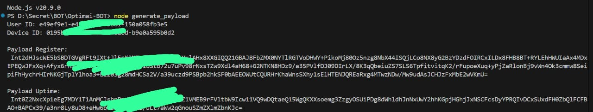

# OptimAi Extension BOT

- Register Here : [OptimAi Dashboard](https://node.optimai.network/register?ref=C93BB492)

## Features

  - Auto Get Account Information
  - Auto Run With [Monosans](https://raw.githubusercontent.com/monosans/proxy-list/main/proxies/all.txt) Proxy - Choose 1
  - Auto Run With Private Proxy - Choose 2
  - Auto Run Without Proxy - Choose 3
  - Auto Claim Daily Check-In
  - Auto Register Nodes & Update The Uptime
  - Multi Accounts With Threads

## Requiremnets

- Make sure you have Python3.9 or higher installed and pip.
- Node.js.

## Instalation

1. **Clone The Repositories:**
   ```bash
   git clone https://github.com/vonssy/OptimAi-BOT.git
   ```
   ```bash
   cd OptimAi-BOT
   ```

2. **Install Requirements:**
   ```bash
   pip install -r requirements.txt #or pip3 install -r requirements.txt
   ```

## Configuration

- **accounts.json:** You will find the file `accounts.json` inside the project directory. Make sure `accounts.json` contains data that matches the format expected by the script. Here are examples of file formats:
  ```bash
  [
      {
          "accessToken": "your_access_token_1",
          "registerPayload": "your_register_payload_1",
          "uptimePayload": "your_uptime_payload_1"
      },
      {
          "accessToken": "your_access_token_2",
          "registerPayload": "your_register_payload_2",
          "uptimePayload": "your_uptime_payload_2"
      }
  ]
  ```

### How to Get Register & Uptime Payload

1. Run the javascript file
   ```javascript
   node generate_payload.js
   ```
2. Enter Your User ID & Device ID
3. Copy The Result and Paste on accounts.json

### Screenshoots

<div style="text-align: center;">
  <h4><strong>User ID</strong></h4>
  
</div>

<div style="text-align: center;">
  <h4><strong>Device ID</strong></h4>
  
</div>

<div style="text-align: center;">
  <h4><strong>Generate Payload</strong></h4>
  
</div>

- **proxy.txt:** You will find the file `proxy.txt` inside the project directory. Make sure `proxy.txt` contains data that matches the format expected by the script. Here are examples of file formats:
  ```bash
  ip:port # Default Protcol HTTP.
  protocol://ip:port
  protocol://user:pass@ip:port
  ```

## Run

```bash
python bot.py #or python3 bot.py
```

## Buy Me a Coffee

- **EVM:** 0xe3c9ef9a39e9eb0582e5b147026cae524338521a
- **TON:** UQBEFv58DC4FUrGqinBB5PAQS7TzXSm5c1Fn6nkiet8kmehB
- **SOL:** E1xkaJYmAFEj28NPHKhjbf7GcvfdjKdvXju8d8AeSunf
- **SUI:** 0xa03726ecbbe00b31df6a61d7a59d02a7eedc39fe269532ceab97852a04cf3347

Thank you for visiting this repository, don't forget to contribute in the form of follows and stars.
If you have questions, find an issue, or have suggestions for improvement, feel free to contact me or open an *issue* in this GitHub repository.

**vonssy**